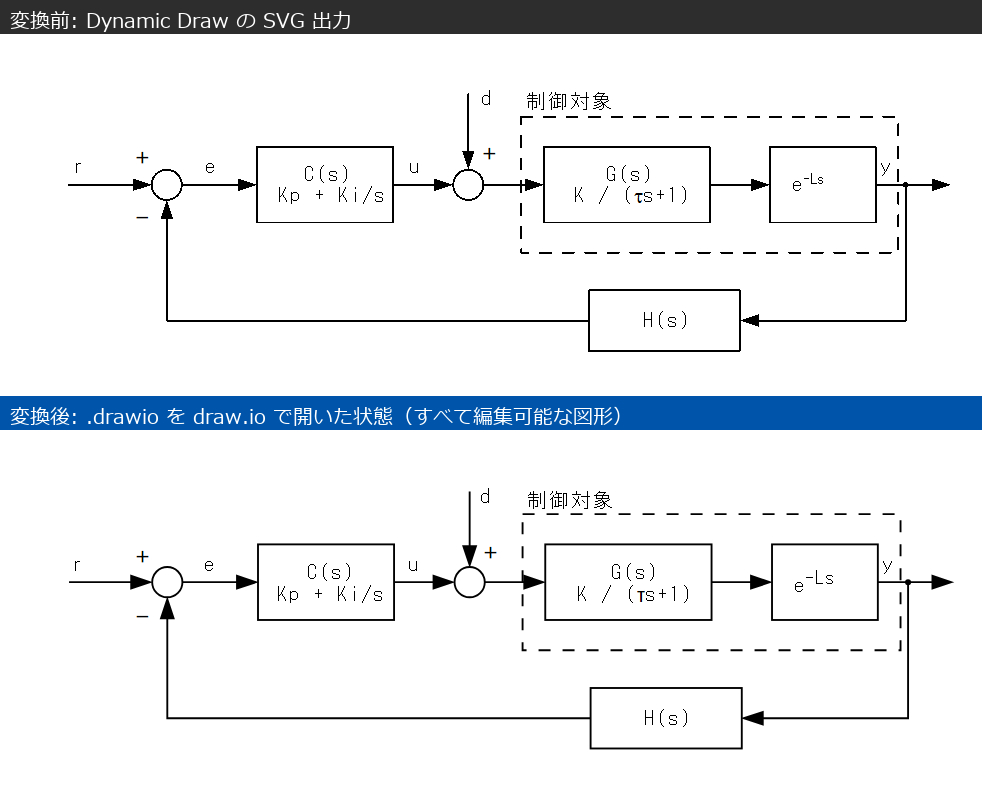
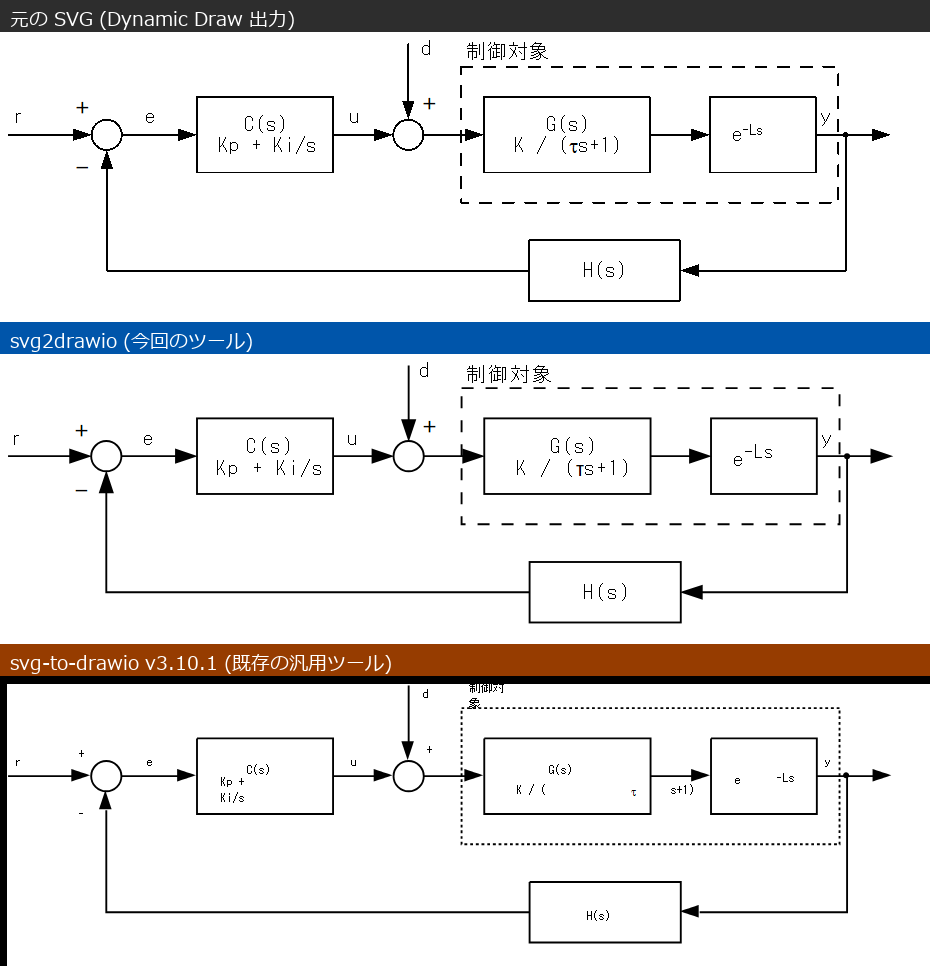

**English** | [日本語](README.ja.md)

# svg2drawio — a draw.io converter dedicated to Dynamic Draw

A Python script that converts diagrams made with **[Dynamic Draw](https://dynamicdraw.com/en/)**
(a free drawing tool for Windows) into **[draw.io (diagrams.net)](https://www.drawio.com/)** files
(`.drawio`) that stay **fully editable**. It needs Python 3.8+ and nothing but the standard library.

This is not a general-purpose SVG converter: it targets **the quirks of Dynamic Draw's SVG export**
in order to reproduce the original drawing faithfully (see [Related projects](#related-projects)
for general-purpose conversion).

Nothing is pasted in as an image. Every part becomes a **native draw.io shape** — rectangle, ellipse,
connector or text — so after conversion you can recolour it, drag it around and retype the labels.



## Why go through SVG?

Dynamic Draw's own format, `.mdpf`, is in fact a **PNG file**. It starts with a 180×180 thumbnail, and
the drawing itself lives in a private PNG chunk named **`mdRw`** as a zlib-compressed MFC-serialised
blob (rename a `.mdpf` to `.png` and you can view the thumbnail). That innermost layer is an
undocumented proprietary binary, so parsing it directly is not a realistic option.

Dynamic Draw's **SVG export**, on the other hand, has a remarkably clean structure: every part is
wrapped in comments that name its type.

```xml
<!-- 矩形部品 ID=416 -->                     <!-- "Rectangle part", in the UI language -->
<g id='Group-416'>
  <defs><symbol id='ObjectBody-3'><path d='M 223 241 C ...' /></symbol></defs>
  <use href='#ObjectBody-3' fill='none' stroke='#0000ffff' stroke-width='0.25' ... />
  <text class='sfont-7' fill='#000000ff'><tspan x='313' y='230'>Smoothing</tspan></text>
</g>
<!-- End of 矩形部品 ID=416 -->
```

Part type, ID, colours, line style and fonts are all recoverable, which makes a mechanical mapping to
draw.io elements possible. This script takes that SVG as its input.

## Usage

### 1. Export SVG from Dynamic Draw

1. Press **Ctrl+A** to select every part
2. Menu: **File > Export selected objects picture**
3. Choose **SVG** as the file type and save

> **Notes**
> - There is also a **File > Export** command, but that one saves the *document* ("used for creating
>   templates" per the manual) and is not an image export. Images — SVG included — can only be
>   produced by *Export selected objects picture*.
> - As the name says, only the **selected** parts are exported, so don't forget the Ctrl+A when you
>   want the whole drawing.
> - There is no "convert text to paths" option; text is always written out as `<text>`.
> - SVG export used to be a separate plug-in and is now built into the application. Older builds may
>   not offer SVG at all, or may have export bugs, so please use the
>   **[latest version of Dynamic Draw](https://dynamicdraw.com/en/)** (it is free software).

### 2. Convert

```bash
python svg2drawio.py drawing.svg -o drawing.drawio
```

Without `-o` the `.drawio` file is written next to the input. The script prints a summary of what it
produced (the labels are Japanese):

```
drawing.svg -> drawing.drawio
  矩形 88 / 円弧 98 / 線 213 (端点接続 330) / テキスト単体 276 / 図形内ラベル 69 / 変換不能 0
  = rectangles 88 / ellipses 98 / lines 213 (330 endpoints attached to shapes) /
    standalone texts 276 / labels inside shapes 69 / not converted 0
```

### 3. Open it in draw.io

Use **File > Open** in draw.io (desktop app or [app.diagrams.net](https://app.diagrams.net/)).

### Bundled sample

The picture at the top of this page is the result of converting it.

```bash
python svg2drawio.py examples/sample.svg -o examples/sample.drawio
```

The sample is a feedback-control block diagram containing the things that typically break a
conversion: nested `tspan`s (a Symbol-font τ and a superscript e<sup>-Ls</sup>), a dashed enclosure,
arrows with bend points and multi-line centred labels.

### Optional: install Pillow for more accurate text placement

If Pillow is available, the script measures text with the actual Windows font files (`msgothic.ttc`
and friends) to decide the original alignment (left / centre / right) and to place labels precisely.
Without it, a rough estimate (1 em per full-width character, 0.5 em per half-width one) is used.

```bash
pip install pillow
```

## What is converted into what

| Dynamic Draw part | Result in draw.io |
|---|---|
| Rectangle (with an outline) | Rectangle shape, reproducing fill, stroke colour, width and dash pattern |
| Rectangle (no outline — text only) | Text shape, positioned from the actual glyph coordinates |
| Arc | Ellipse shape |
| Polyline | **Connector**, with bend points (waypoints), arrowheads and curves |
| OLE part (equations etc.) | Embedded image, or `$$...$$` math text with `--ole-latex` |
| Text inside a part | Label of that shape, matching the original alignment and line spacing |

On top of that, the converter does the following.

- **Attaches endpoints automatically** — when a line ends on a shape's outline it becomes a real
  connection, so dragging the shape drags the line with it. The attachment point is pinned with
  `exitX`/`entryX`, so the drawing looks exactly as before right after conversion.
- **Corrects arrowheads** — Dynamic Draw stops the line short and draws the arrowhead as a separate
  path, so the endpoint is extended to the tip of the arrowhead and its real length goes into `endSize`.
- **Flattens nested `tspan`s** — font switches and superscripts (z⁻¹) are restored as `<sup>`.
- **Maps the Symbol font to Unicode** — `m` → `μ`, `D` → `Δ` and so on. Those characters get a Latin
  font, because a Japanese font would render them full-width.
- **Converts units** — SVG user units (mm) become 96 dpi pixels, and the page size is set to match.
- **Identifies parts independently of the UI language** — the part names in the comments depend on
  Dynamic Draw's display language, so both Japanese and English names are recognised; if the name is
  unknown, the type is inferred from the path itself (is it closed? are the corners axis-aligned? is
  it a Bézier curve?).

## OLE parts (Microsoft Equation 3.0 and friends)

Dynamic Draw exports OLE parts **in a form that never renders**:

```xml
<symbol id='OleImage-52'><image x='0' y='0' width='0' height='0' href='data:image/png;base64,...' /></symbol>
<use href='#OleImage-52' transform='translate(22.39 14.69) scale(inf, inf)' />
```

With `width='0' height='0'` and `scale(inf, inf)`, browsers and other tools draw nothing — which is
why the equations look like they vanished. The **PNG data itself is intact**, however, so this
converter restores each OLE part as an embedded image, using the recorded position and the PNG's
aspect ratio.

### Pass the .mdpf and the maths convert themselves (recommended)

The `.mdpf` still contains the **original equation data (MathType MTEF)** and the **bounding
rectangle of every part in millimetres**. Hand it the mdpf and equations are converted to LaTeX
automatically, at their true size:

```bash
python svg2drawio.py drawing_1.svg --mdpf drawing.mdpf
```

The SVG is exported as a crop of the drawing, so the two coordinate systems are offset — the
converter recovers the offset by **voting over pairs whose aspect ratios agree**, so you never have
to say which sheet an SVG came from.

Equation sizes use **one base size for the whole document, shrunk only for the equations that would
not fit** their bounding rectangle. Because the typesetting estimate has some error, equations are
laid out at 0.8 of the rectangle by default (measured over 1762 equations, that leaves 1.6%
overflowing; use `--eq-margin 0.9` if you prefer them larger). The base size is the median of the largest size that fits each
equation (the typesetting-size estimator was fitted against MathJax measurements of 88 equations).

### Converting many files at once

Give it a folder and it pairs `xxx.mdpf` with `xxx_1.svg, xxx_2.svg, …` (or `xxx.svg`) and writes
**`xxx.drawio` with one page per sheet**:

```bash
python svg2drawio.py path/to/drawings/
```

With no argument at all it processes the current folder.
If an SVG has no identically-named `.mdpf`, the converter tries the other mdpf files in the folder and
picks the one whose OLE parts line up — so renamed files still find their source.


### Assigning LaTeX by hand (when you have no .mdpf)

If you want LaTeX instead of a picture, it takes three steps. The SVG only carries a rasterised PNG,
so the structure of the formula has to be **read off the image**:

```bash
# 1. Dump the OLE images so you can see what they contain
python svg2drawio.py test.svg --dump-ole ole/

# 2. Write a mapping file (ole_latex.txt); backslashes need no escaping
#    52 = x_{ref}
#    96 = \frac{1}{M_d s^2 + D_d s + K_d}
#    97 = \Delta x

# 3. Convert with the mapping
python svg2drawio.py test.svg --ole-latex ole_latex.txt -o test.drawio
```

Those parts become text cells wrapped in `$$...$$`, and the file gets `math="1"` so draw.io typesets
them on open (the manual switch is **View > Math Typesetting**). JSON (`{"52": "x_{ref}"}`) works too.

### Sizing

With a `.mdpf` the true size is used. From the SVG alone the display size is lost, so **it is a guess**.
`--ole-size` (height of one line of maths, in mm, default 4.5) scales everything, and `--ole-font`
(px) sets just the font size in math mode. Individual items are easy to nudge in draw.io afterwards.

## Accuracy

The original SVG and the converted `.drawio` (rendered by the official draw.io viewer) are drawn in
the same coordinate system at 1565×1099 px and their black pixels compared with a 2 px tolerance.
Measured on a control block diagram of 675 parts and 576 text elements:

| | Share |
|---|---|
| Pixels present in the original but missing after conversion | 4.8% |
| Pixels that only exist after conversion | 3.4% |
| Lines that should be orthogonal but came out diagonal | 0 / 213 |

What remains is almost entirely text anti-aliasing (sub-pixel bleed).

## Known limitations

- **Open arcs** become complete ellipses (the arc angles are not used)
- **Lines containing curves** are approximated with draw.io's `curved=1`
- **Rotated rectangles** become their bounding boxes
- Connectors are reconstructed from geometry, so the **logical connections** of the original drawing
  are inferred from endpoint positions. An arrow that stops short of a shape is left as fixed
  coordinates rather than attached.
- Arrowheads are replaced by draw.io's standard marker (`blockThin`), so unusual arrow shapes will look
  different
- **From an SVG alone**, the display size of an OLE part cannot be recovered (`--ole-size` provides
  an estimate) and LaTeX cannot be generated automatically. Passing the `.mdpf` solves both
- MTEF → LaTeX covers the everyday constructs (fractions, sub/superscripts, roots, fences, Greek
  letters, integrals, sums). Equations using matrices or unsupported glyphs fall back to images
- Only four part types are handled: rectangle, arc, polyline and OLE. Anything else is reported as
  "not converted" (`変換不能`) in the summary line.

## Tunable constants

They sit at the top of `svg2drawio.py`.

| Constant | Default | Meaning |
|---|---|---|
| `EQ_MARGIN` | `0.8` | Fraction of the rectangle an equation is fitted into (`--eq-margin`) |
| `SNAP_TOL` | `0.7` | How close (mm) a line endpoint must be to a shape to be attached to it |
| `SMALL_SHAPE` | `4.0` | Shapes smaller than this (mm) also accept endpoints that stop inside them |
| `OLE_MM` | `4.5` | Short side of an OLE part (mm); overridden by `--ole-size` |
| `PART_KINDS` | — | Part name (Japanese / English) → shape type |
| `FONT_MAP` | — | SVG font name → draw.io font name |
| `SYMBOL_MAP` | — | Adobe Symbol character → Unicode |

## Related projects

**For general-purpose SVG → draw.io conversion, use
[svg-to-drawio](https://github.com/V1rg1lee/svg-to-drawio).** It is a well-built general tool that
handles transforms, gradients, clip-paths, masks and embedded images. This repository does not try to
compete with that; it trades generality for fidelity **on Dynamic Draw output specifically**.

Both tools converting the same sample ([examples/sample.svg](examples/sample.svg)), with
svg-to-drawio v3.10.1, as of 2026-08-18:



| | This tool | svg-to-drawio |
|---|---|---|
| Pixel difference vs. original (missing / extra) | **6.4% / 5.8%** | 8.5% / 5.4% |
| Connectors | **9** (bend points, arrowheads, attached to shapes) | 0 (lines become shapes too) |
| Shape types | Native rectangles and ellipses | `shape=stencil(...)` (compressed paths) |
| Text grouping | 13 cells (original line structure kept) | 18 cells (nested tspans split: `K / (` `t` `s+1)`) |
| Superscript (e<sup>-Ls</sup>) | Restored as `<sup>` | `e` and `-Ls` end up in separate cells |
| Symbol font (τ, μ) | Mapped to Unicode | Left as the original character codes |
| Font size | 10.6 px (matches the original 2.8 mm) | 6 px |
| Unwanted line wrapping | None | "制御対象" and "Kp + Ki/s" break into two lines |
| Page size | Set from the original paper size | Not set |
| Generality (transforms, gradients, …) | Not supported | **Supported** |

Dynamic Draw has habits of its own — it stops the line body before the arrowhead, it records the part
type in a comment, it switches fonts through nested `tspan`s — and knowing about them is what makes
the difference. Conversely, for SVG that did not come from Dynamic Draw this tool has no advantage.

## License

MIT License. See [LICENSE](LICENSE) for details.
